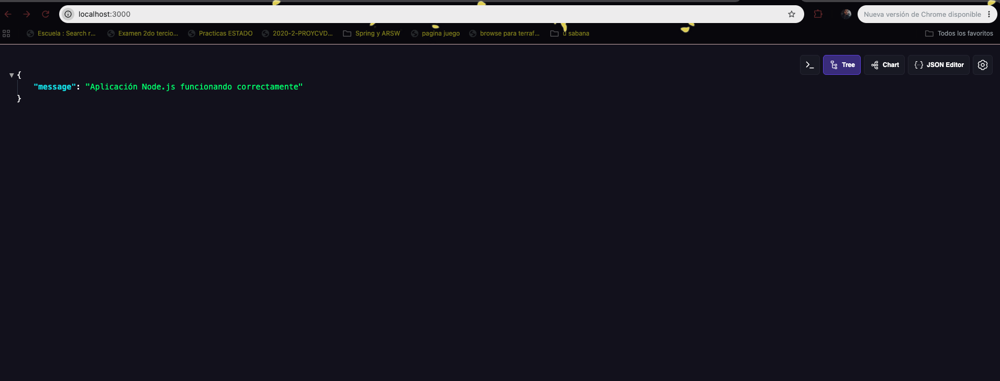
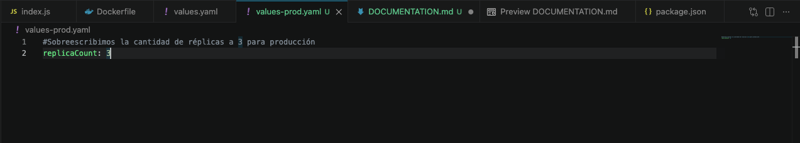

# 🚀 Despliegue de Microservicio con Docker, Helm y Kubernetes

Este repositorio contiene la implementación de un microservicio básico, su contenedorización con Docker y el proceso de despliegue en Kubernetes utilizando Helm, cumpliendo con los estándares de arquitectura escalable y mantenible.

## 🛠️ Tecnologías Utilizadas
* **Node.js & Express:** Para la creación del microservicio.
* **Docker:** Para empaquetar la aplicación en contenedores.
* **Docker Hub:** Como registro de imágenes.
* **Kubernetes (K8s):** Para la orquestación local de los contenedores.
* **Helm:** Para la gestión de paquetes y configuraciones del clúster.

---

## 📦 1. Construcción del Microservicio y Dockerización

Se desarrolló una API sencilla en Node.js que expone un endpoint principal y uno de *health check*. Posteriormente, se creó un `Dockerfile` optimizado para empaquetar la aplicación.

### Evidencia del contenedor corriendo localmente:


La imagen fue etiquetada y subida a un registro público para facilitar su despliegue en cualquier clúster.
* **Enlace a Docker Hub:** `[110210]/mi-microservicio:v1`

---

## 🎈 2. Configuración de Helm Charts

Para el despliegue en Kubernetes, se generaron *charts* de Helm (`app-chart`), lo que nos permite gestionar las configuraciones de manera estandarizada y dinámica.

### Uso de Valores por Defecto y Overrides
Se configuró el archivo base `values.yaml` para apuntar a la imagen alojada en Docker Hub. Adicionalmente, se creó un archivo `values-prod.yaml` para actuar como un **override** de entorno. Esto nos permite personalizar el despliegue sin modificar el chart original (por ejemplo, escalando el `replicaCount` a 3 para simular un entorno de producción).

### Evidencia de los archivos de configuración:
 

---

## 🚀 3. Despliegue Manual con Helm

Una vez configurados los charts, se procedió a instalar la aplicación en el clúster local de Kubernetes aplicando el *override* de producción mediante el siguiente comando:

```bash
helm install mi-app ./app-chart -f values-prod.yaml