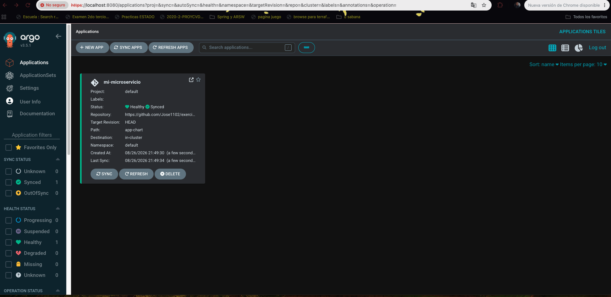
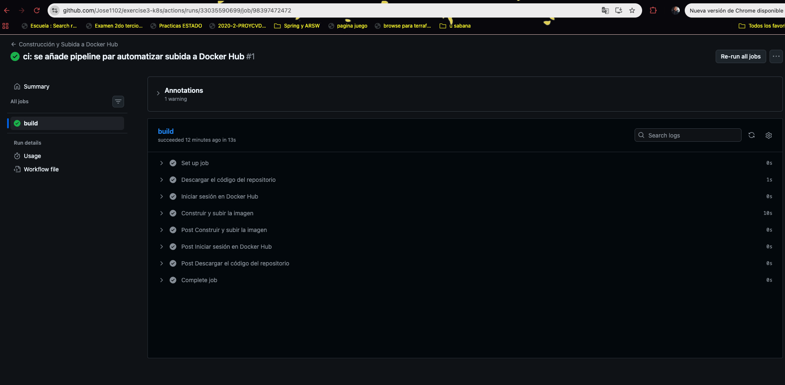
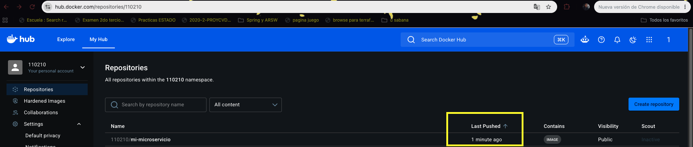

# 🚀 Despliegue de Microservicio con Docker, Helm y Kubernetes

Este repositorio contiene la implementación de un microservicio básico, su contenedorización con Docker y el proceso de despliegue en Kubernetes utilizando Helm, cumpliendo con los estándares de arquitectura escalable y mantenible.

## 🎬 Vídeo demostración
https://github.com/user-attachments/assets/1c4f7037-fe33-4578-8e41-50b7963cb2ed

## 🛠️ Tecnologías Utilizadas

- **Node.js & Express:** Para la creación del microservicio.

- **Docker:** Para empaquetar la aplicación en contenedores.

- **Docker Hub:** Como registro de imágenes.

- **Kubernetes (K8s):** Para la orquestación local de los contenedores.

- **Helm:** Para la gestión de paquetes y configuraciones del clúster.

---

## 📦 1. Construcción del Microservicio y Dockerización

Se desarrolló una API sencilla en Node.js que expone un endpoint principal y uno de *health check*. Posteriormente, se creó un `Dockerfile` optimizado para empaquetar la aplicación.

### Evidencia del contenedor corriendo localmente:


La imagen fue etiquetada y subida a un registro público para facilitar su despliegue en cualquier clúster.

- **Enlace a Docker Hub:** `[110210]/mi-microservicio:v1`

---

## 🎈 2. Configuración de Helm Charts

Para el despliegue en Kubernetes, se generaron *charts* de Helm (`app-chart`), lo que nos permite gestionar las configuraciones de manera estandarizada y dinámica.

### Uso de Valores por Defecto y Overrides

Se configuró el archivo base `values.yaml` para apuntar a la imagen alojada en Docker Hub. Adicionalmente, se creó un archivo `values-prod.yaml` para actuar como un **override** de entorno. Esto nos permite personalizar el despliegue sin modificar el chart original (por ejemplo, escalando el `replicaCount` a 3 para simular un entorno de producción).

### Evidencia de los archivos de configuración:


---

## 🚀 3. Despliegue Manual con Helm

Una vez configurados los charts, se procedió a instalar la aplicación en el clúster local de Kubernetes aplicando el *override* de producción mediante el siguiente comando:

```bash
helm install mi-app ./app-chart -f values-prod.yaml
```

---

## 🐙 4. Implementación de GitOps con ArgoCD

Para evolucionar la infraestructura hacia un modelo automatizado, se eliminó el despliegue manual y se adoptó la metodología **GitOps** utilizando ArgoCD. Ahora, el repositorio de GitHub actúa como la única fuente de la verdad.

1. Se instaló ArgoCD dentro del clúster de Kubernetes en su propio *namespace*.

2. Se conectó el repositorio de GitHub a la interfaz de ArgoCD.

3. Se configuró la aplicación para que apunte directamente a la carpeta `app-chart`, leyendo el archivo `values-prod.yaml` como *override* de entorno.

De esta manera, cualquier cambio en la configuración de la infraestructura subido a la rama principal (`main`), es detectado y sincronizado automáticamente por ArgoCD en el clúster.

### Evidencia de ArgoCD sincronizado:



---

## 🧪 5. Guía para ejecutar y probar el proyecto

Una vez configurado y desplegado el microservicio mediante ArgoCD, consulta la siguiente guía para realizar el proceso de ejecución y prueba del servicio:

👉 **[Ver guía de ejecución y pruebas](./RUN_LOCAL_PROJECT.md)**

Esta guía contiene el paso a paso para clonar el proyecto, configurar Kubernetes, instalar ArgoCD, desplegar el microservicio y acceder al servicio localmente.

---

## ⚙️ 6. Integración y Despliegue Continuo (CI/CD)

Como último paso, se configuró un pipeline de Integración Continua utilizando **GitHub Actions** para automatizar el ciclo de vida del desarrollo.

Se creó un flujo de trabajo (`.github/workflows/pipeline.yml`) que reacciona a cada *push* en la rama `main`. Este pipeline se encarga de:

1. Descargar el código fuente más reciente.

2. Autenticarse de forma segura en Docker Hub utilizando *GitHub Secrets*.

3. Construir una nueva versión de la imagen de Docker.

4. Subir automáticamente la nueva imagen al registro público.

Con este flujo, al hacer un cambio en el código del microservicio, la nueva versión del contenedor se genera y publica sin intervención humana.

### Evidencia del Pipeline ejecutado con éxito:



### Evidencia de la nueva imagen en Docker Hub:



---

## 🎯 Conclusión

El proyecto integra exitosamente el desarrollo de un microservicio en Node.js, su contenedorización, orquestación dinámica con Kubernetes y Helm, y una automatización total mediante prácticas GitOps (ArgoCD) y CI/CD (GitHub Actions), cumpliendo con los estándares modernos de la industria.